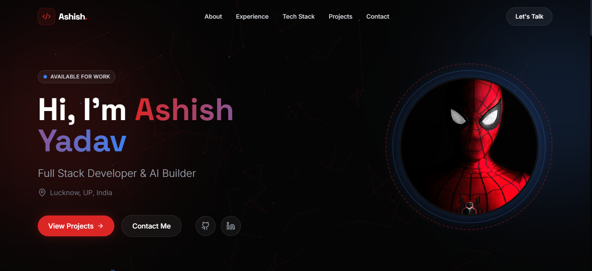

# ⚡ Ashish Yadav — 3D Portfolio

> Full Stack Developer & AI Builder based in Lucknow, India.



## 🚀 Live Demo

🔗 [View Portfolio](https://ashyadavweb.netlify.app/)

---

## ✨ Features

- 🕸️ Interactive Three.js particle web — reacts to mouse movement
- 🎞️ Smooth scroll-driven animations with Framer Motion
- 🃏 3D tilt effect on project cards
- 🧭 Sticky glass navbar with animated active indicator
- 📬 Contact form with toast feedback
- 📱 Fully responsive design
- 🎨 Spider-Man inspired dark theme

## 🛠️ Tech Stack

| Category | Tech |
|----------|------|
| Frontend | React 18, TypeScript |
| Styling | TailwindCSS, Framer Motion |
| 3D | Three.js |
| Icons | Lucide React |
| Notifications | Sonner |
| Build | Vite |
| Deploy | Netlify |

## 📁 Project Structure

```
src/
├── components/
│   ├── Hero.tsx        # 3D particle background + intro
│   ├── About.tsx       # About section
│   ├── Experience.tsx  # Work experience
│   ├── TechStack.tsx   # Skills grid
│   ├── Projects.tsx    # 3D tilt project cards
│   ├── Contact.tsx     # Contact form
│   ├── Navbar.tsx      # Sticky navbar
│   ├── Footer.tsx      # Footer
│   └── ThreeScene.tsx  # Three.js particle scene
├── App.tsx
├── index.tsx
└── index.css
```

## 🏃 Run Locally

```bash
git clone https://github.com/ashish7802/Personalweb.git
cd Personalweb
npm install
npm run dev
```

## 📦 Build

```bash
npm run build
```

## 📄 License

MIT © [Ashish Yadav](https://github.com/ashish7802)
